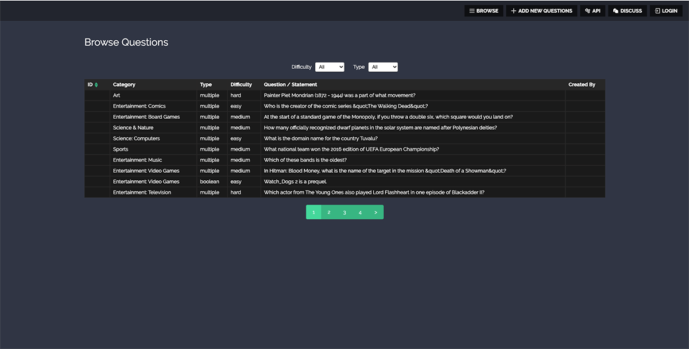

## Browser APP screenshot preview

## TODO

- Fix characters encode
- Display a message when the API doesn't return results
- Add Pagination functionality
- Get filter options and values from results
- Fix Filters when click on two options.
- Add lint and tests

## About the project
This project was bootstrapped with [Create React App](https://github.com/facebook/create-react-app). 

In the project directory, you can do `npm start` to run the app in the development mode. 
Open [http://localhost:3000](http://localhost:3000) to view it in the browser. 
 
To filter the results by Difficulty or Type, click on "Browse" and select an option. 
